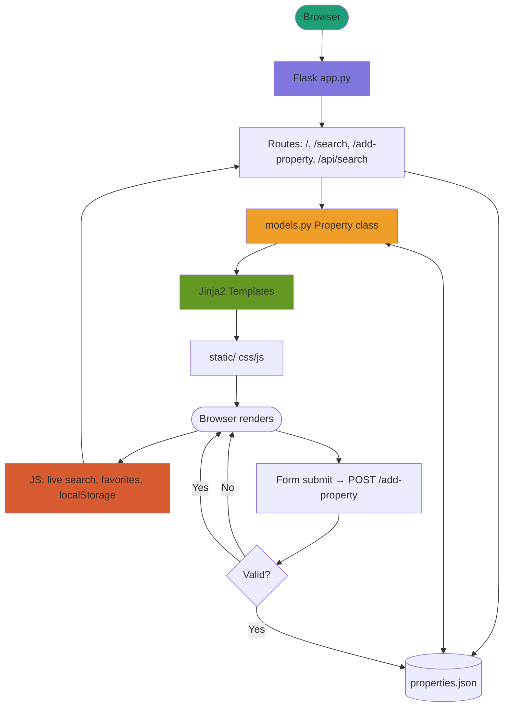

# AQAR MISR — Real Estate Web Application

A fully functional real estate web application built as a final course project.

Users can browse many premium property listings across Egypt, filter by area, type, and price, save favourites to their account, submit new listings with image upload, enquire via a contact form, and purchase through a Buy Now flow.

---

## Prerequisites

Install the following before running the app:

```bash
pip install flask werkzeug
```

All other imports (`json`, `os`, `hashlib`, `datetime`, `functools`) come from Python's Standard Library — no extra installation needed.

---

## How to Run

```bash
# 1. Clone the repository
git clone https://github.com/alzahraamohy/AQAR-MISR.git
cd AQAR-MISR

# 2. Install dependencies
pip install flask werkzeug

# 3. Run the app
python app.py

# 4. Open in browser
# http://127.0.0.1:5000
```
---

## Project Checklist

- [x] **It is available on GitHub.**
  - Repository: https://github.com/alzahraamohy/AQAR-MISR.git

- [x] **It uses the Flask web framework.**
  - File: `app.py` — all `@app.route()` definitions, `render_template()`, `request`, `session`, `redirect`

- [x] **It uses at least one module from the Python Standard Library other than the random module.**
  - Module name: `datetime`
  - File: `models.py`, line 2 — `from datetime import datetime`
  - Used in: `User.__init__()` line 13 and `Property.__init__()` line 65 — `datetime.now().isoformat()` automatically timestamps every new user account and property listing

- [x] **It contains at least one class that has both properties and methods.**

  **Class 1: `Property`**
  - File name for the class definition: `models.py`
  - Line number for the class definition: line 48
  - Name of two properties: `self.title` (line 54), `self.price` (line 55)
  - Name of two methods: `get_summary` (line 68), `matches_filter` (line 93)
  - File name and line numbers where the methods are used:
    - `get_summary()` used in `app.py` line 367 (inside `add_property()`)
    - `matches_filter()` used in `app.py` line 255 (inside `search()`)

  **Class 2: `User`**
  - File name for the class definition: `models.py`
  - Line number for the class definition: line 5
  - Name of two properties: `self.name` (line 9), `self.email` (line 10)
  - Name of two methods: `toggle_favorite` (line 30), `get_display_name` (line 39)
  - File name and line numbers where the methods are used:
    - `toggle_favorite()` used in `app.py` line 211 (inside `toggle_favorite()` route)
    - `get_display_name()` used in `base.html` inside `{{ user.get_display_name() }}`

- [x] **It makes use of JavaScript in the front end and uses the localStorage of the web browser.**
  - File: `static/js/main.js`
  - localStorage write: `localStorage.setItem("aqar_user_id", ...)` — lines 28–34
  - localStorage read: `localStorage.getItem("aqar_user_id")` — lines 46–49
  - localStorage clear: `localStorage.removeItem(...)` — lines 25, and inside `clearUserLocalStorage()`
  - The user's ID, name, email, and favourites list are all stored and retrieved from localStorage

- [x] **It uses modern JavaScript (for example, let and const rather than var).**
  - File: `static/js/main.js`
  - All variable declarations use `let` and `const` throughout the file

- [x] **It makes use of the reading and writing to the same file feature.**
  - File: `app.py`
  - Read: `load_properties()` lines 37–60 — opens `data/properties.json` in `"r"` (read) mode and uses `json.load()`
  - Write: `save_properties()` lines 63–68 — opens the same `data/properties.json` in `"w"` (write) mode and uses `json.dump()`
  - Same file constant used in both: `DATA_FILE = "data/properties.json"` (line 17)

- [x] **It contains conditional statements.**
  - File: `app.py`
  - Line 128: `if not name or not email or not password:` — validates signup form fields
  - File: `models.py`
  - Lines 95–107: `if area:`, `if prop_type:`, `if max_price:` — inside `matches_filter()`

- [x] **It contains loops.**
  - File: `app.py`
  - Line 43: `for item in raw_list:` — inside `load_properties()`, converts every dictionary to a Property object
  - Line 251: `for prop in all_props:` — inside `search()`, filters every property against the user's chosen filters
  - File: `models.py`
  - Line 30: `if prop_id in self.favorites:` with `.remove()` and `.append()` — inside `toggle_favorite()`

- [x] **It lets the user enter a value in a text box at some point. This value is received and processed back end Python code.**
  - File: `add_property.html` — form with text inputs for title, area, description, and why_choose
  - File: `app.py` lines 332–336 — `request.form.get("title", "")`, `request.form.get("area", "")` etc. read every field submitted by the user and process them to create a new Property object

- [x] **It doesn't generate any error message even if the user enters a wrong input.**
  - File: `app.py` lines 338–346 — numeric fields (`price`, `bedrooms`, `bathrooms`, `latitude`, `longitude`) are wrapped in `try: int(...) except ValueError:` — if the user types letters instead of numbers, the app shows a friendly error message in the browser instead of crashing
  - File: `app.py` lines 128–138 — all text validation checks return `render_template(..., error="...")` instead of raising exceptions

- [x] **It is styled using my own CSS.**
  - File: `static/css/style.css` — written from scratch with no external framework (no Bootstrap, no Tailwind)
  - Includes: CSS variables for the full colour palette, navbar, hero, cards grid, filter bar, property detail layout, auth pages, profile page, favourites page, toast notification, and responsive media queries for mobile and tablet

- [x] **The code follows the code and style conventions, is fully documented using comments, and doesn't contain unused or experimental code. In particular, the code should not use `print()` or `console.log()` for any information the app user should see.**
  - Every function in `app.py` and `models.py` has a comment explaining its purpose
  - All user feedback (errors, success messages) is shown in the browser via `error=` and `success=` template variables rendered by Jinja2
  - JavaScript feedback is shown via `showToast()` in `main.js` which creates a visible DOM element — no `console.log()` is used for user-facing messages
  - No unused functions, test routes, or experimental code remains in any file

- [x] **All exercises have been completed as per the requirements and pushed to the respective GitHub repository.**
